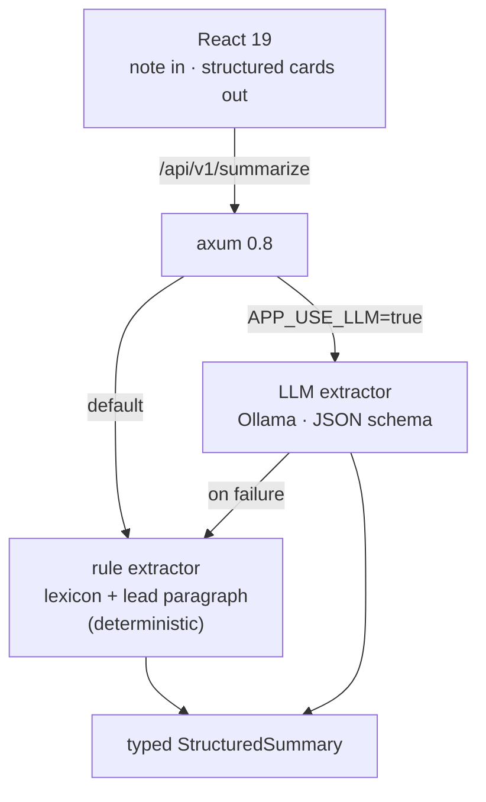

<p align="center">
  <h1>📄 Medical Document Summarizer</h1>
  <p><b>Clinical note → structured summary — findings, medications, conditions</b></p>
  <p>
    <a href="https://github.com/akarales/medical-document-summarizer/actions/workflows/ci.yml"></a>
    
    
    
    
  </p>
</p>

Paste a clinical note, get a **structured summary**: findings,
medications, conditions, and a lead-paragraph summary — produced by two
extraction backends behind one typed result. A **deterministic rule
extractor** (transparent keyword lexicon) is the default; an **LLM
extractor** (Ollama, JSON-schema constrained) upgrades it when
configured, and the rules run again on any LLM failure. Graceful
degradation is the design. Rust (axum) + React.

**Jump to:** [Features](#-features) · [Architecture](#-architecture) · [Quickstart](#-quickstart) · [Configuration](#️-configuration) · [API](#-api) · [Docs](#-documentation) · [Roadmap](#️-roadmap)

> [!CAUTION]
> Demo output from synthetic notes — not medical advice; verify before
> any clinical use. Never paste real PHI into a demo.

## ⚡ Features

- **Structured extraction** — typed `StructuredSummary` (findings,
  medications, conditions, summary) from either backend; the caller only
  sees a `backend` field difference
- **Transparent rule backend** — medications/conditions/findings cue
  tables live in one auditable file; zero false positives on unrelated
  text (pinned by test)
- **Schema-constrained LLM backend** — Ollama with a JSON schema at
  temperature 0.1; the rules run again automatically on failure
- **Zero-GPU demo** — the rule backend is fully functional offline

## 📐 Architecture



## 🚀 Quickstart

```bash
cargo run               # :8010 — rule extractor
cd frontend && pnpm install && pnpm dev   # → http://localhost:5173

# LLM mode (requires Ollama)
APP_USE_LLM=true cargo run
```

## ⚙️ Configuration

| Variable | Default | Notes |
|----------|---------|-------|
| `APP_PORT` | `8010` | 8000–8009 taken on this machine |
| `APP_USE_LLM` | `false` | rule extractor when false |
| `APP_OLLAMA_URL` | `http://localhost:11434` | used when APP_USE_LLM=true |
| `APP_OLLAMA_MODEL` | `qwen3:14b` | local GPU model |

## 📡 API

| Endpoint | Purpose |
|----------|---------|
| `GET /health` | liveness |
| `POST /api/v1/summarize` | `{note}` → structured summary (backend-tagged) |

Payload: [docs/API.md](docs/API.md).

## 📚 Documentation

| Page | What's inside |
|------|---------------|
| [docs/ARCHITECTURE.md](docs/ARCHITECTURE.md) | The two backends, the fallback chain, lexicon policy |
| [docs/API.md](docs/API.md) | Summarize request/response |
| [docs/DEVELOPMENT.md](docs/DEVELOPMENT.md) | Setup, extending the lexicon (safely) |

## 🗺️ Roadmap

<details>
<summary>Phased plan</summary>

- [x] Phase 0 — scaffold: dual extractors, typed summary, UI, CI
- [ ] Phase 1 — section-aware parsing (HPI, meds, plan)
- [ ] Phase 2 — dosing/frequency extraction; negation handling
- [ ] Phase 3 — PHI-safe input via the secure-ai-gateway pipeline

</details>

## 🤝 Contributing

PRs welcome — see [CONTRIBUTING.md](CONTRIBUTING.md). Gates: `cargo
clippy --all-targets -- -D warnings`, `cargo test -q`, `pnpm build`.

## 📄 License

MIT — see [LICENSE](LICENSE).
